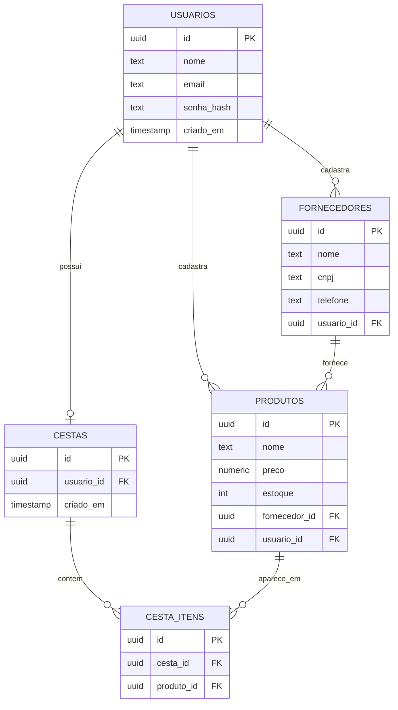

# Sistema de Gestão de Produtos

Mini sistema de gestão de produtos desenvolvido para a disciplina de ADS. Cadastro de usuários com autenticação, cadastro de Produtos e Fornecedores com relacionamento entre eles, e montagem de uma Cesta de compras.

## Tecnologias

- **Backend:** PHP + PDO (driver `pgsql`)
- **Banco de dados:** PostgreSQL, hospedado no Supabase
- **Frontend:** HTML, CSS, JavaScript (fetch/AJAX) + Bootstrap 5

## Como rodar o projeto

1. Clone o repositório.
2. Em `config/database.php`, preencha a senha do banco (Project Settings > Database > Connection string, no painel do Supabase).
3. Suba um servidor PHP local na raiz do projeto:
   ```
   php -S localhost:8000
   ```
4. Acesse `http://localhost:8000/index.php`. As tabelas são criadas automaticamente na primeira conexão, não precisa rodar SQL manualmente.

## Etapa 1 — Análise

### Telas do sistema
- Login
- Cadastro de usuário
- Dashboard: cadastro de Produtos e Fornecedores, atualização via AJAX, seleção de produtos
- Minha Cesta

### Menu de navegação
Presente em todas as páginas autenticadas (`includes/nav.php`), com acesso ao Dashboard, à Cesta e à opção de sair.

### Wireframes
Protótipo no Figma: [Sistema de Gestão de Produtos](https://www.figma.com/make/126q8BSyJwpiInVfJCrBhL/Sistema-de-Gest%C3%A3o-de-Produtos?t=YRrCuh2GSaDcHAnQ-1)

## Etapa 2 — Modelagem

### Diagrama Entidade-Relacionamento



## Etapa 3 — Implementação

### Estrutura de pastas

```
config/database.php   - conexão PDO e criação automática das tabelas
classes/               - classes de domínio: Usuario, Produto, Fornecedor, Cesta
api/                   - endpoints AJAX: auth.php, produtos.php, fornecedores.php, cesta.php
includes/nav.php       - menu de navegação
index.php              - login
cadastro.php           - cadastro de usuário
dashboard.php          - cadastro, atualização AJAX e seleção de produtos
carrinho.php           - exibição da cesta
```

### Funcionalidades
- Cadastro de usuário com senha em hash SHA-256 (`Usuario::hashSenha`)
- Login com sessão PHP (`$_SESSION`)
- Cadastro de Produtos e Fornecedores, relacionados entre si
- Atualização via AJAX de Produto, Fornecedor e itens da Cesta, sem recarregar a página
- Seleção de produtos por checkbox com validação (mínimo 1 selecionado), adicionados a uma Cesta
- Exibição da Cesta com valor total e quantidade de itens, usando as classes `Produto` e `Cesta`

### Equipe
_Listar aqui os integrantes e o GitHub de cada um._

## Changelog

Formato baseado em [Keep a Changelog](https://keepachangelog.com/pt-BR/1.0.0/).

## [Unreleased]

### Added
- Estrutura inicial do backend em PHP com conexão PDO ao Postgres do Supabase
- Criação automática das tabelas (usuarios, fornecedores, produtos, cestas, cesta_itens)
- Autenticação com hash SHA-256 e sessão PHP
- Classes de domínio: Usuario, Produto, Fornecedor, Cesta
- CRUD de Produtos e Fornecedores
- Área de atualização via AJAX (Produto, Fornecedor, item da Cesta)
- Seleção de produtos por checkbox e montagem da Cesta
- Página de exibição da Cesta com total e quantidade de itens
- Protótipo de telas no Figma